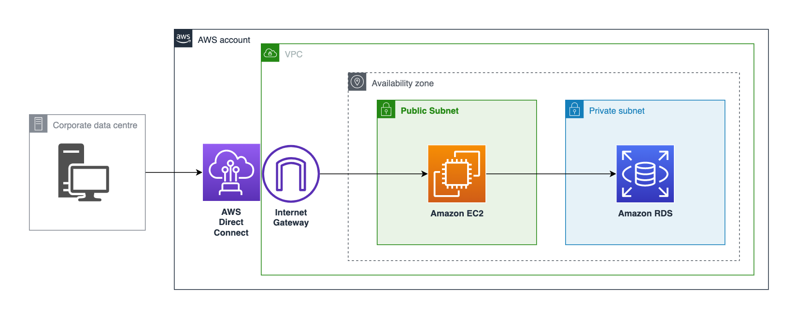

# RDS - SQL – Session DB

## Metadata
| attribute               | value                                         |
| ----------------------- | --------------------------------------------- |
| pattern-id              | cba.rdbms.rds.sessiondb                            |
| pattern-name            | RDS - SQL – Session DB                                |
| pattern-version         | 1.0.0                                         |
| pattern-description     | RDS SQL will be used for our CommBiz web UI to store and mange session data.                         |
| organisation-id         | cba                                           |
| pattern-categories      | RDBMS                                     |

## What is this pattern?
This pattern helps to create an RDBMS on AWS RDS to manage and maintain App sessions.

## What are the use cases?
This pattern is a basic template, modify it as you see fit

## Variables

| Variable               | Source                                         | Value |
| -----------------------| --------------------------------------------- | ------|
| Var1                   | SSM Parameter | onp/bootstrap/base-template|